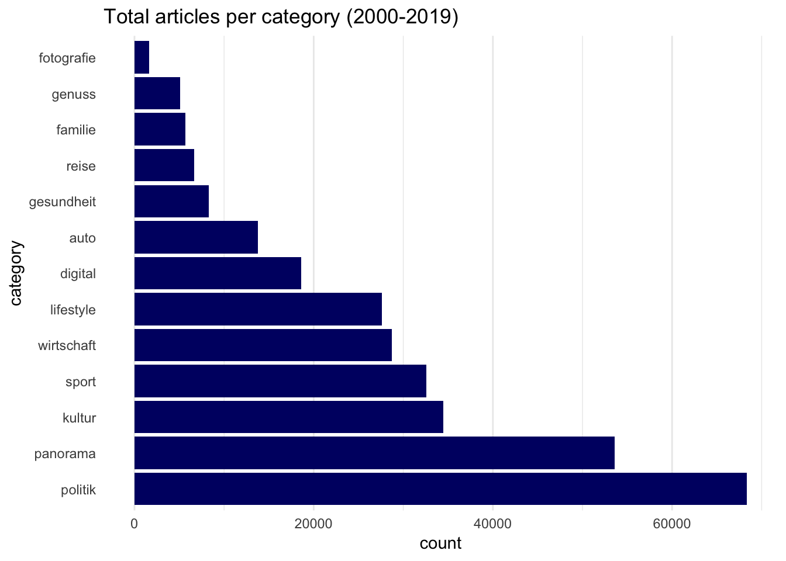
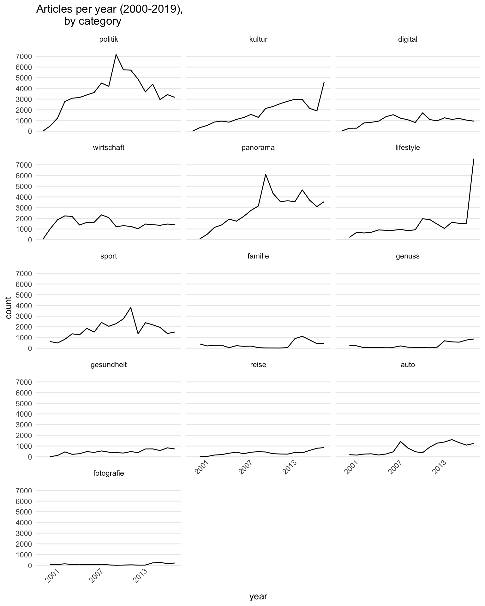
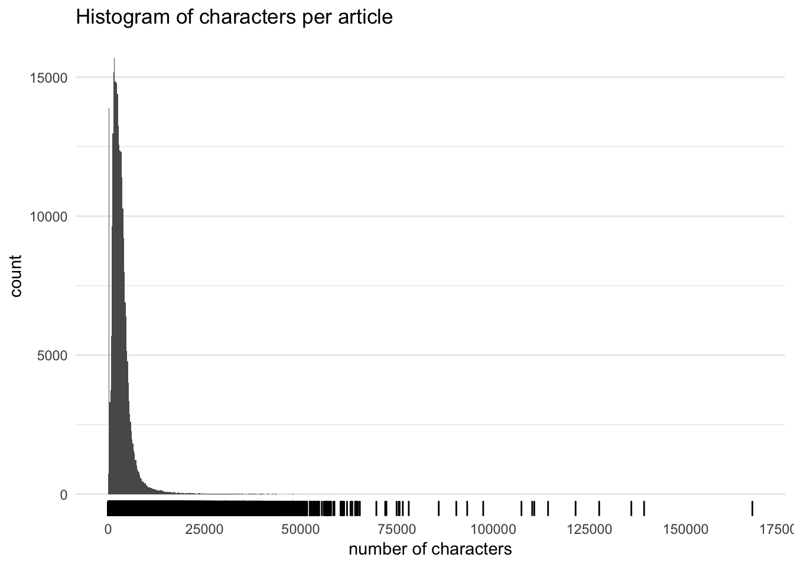
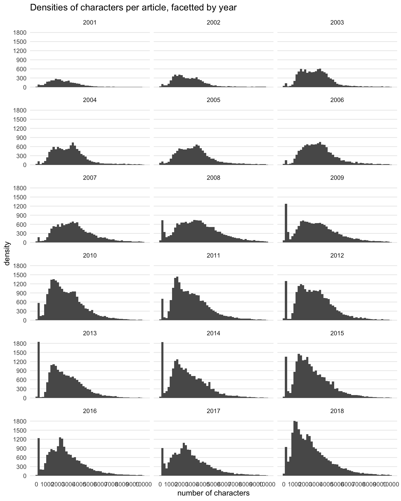
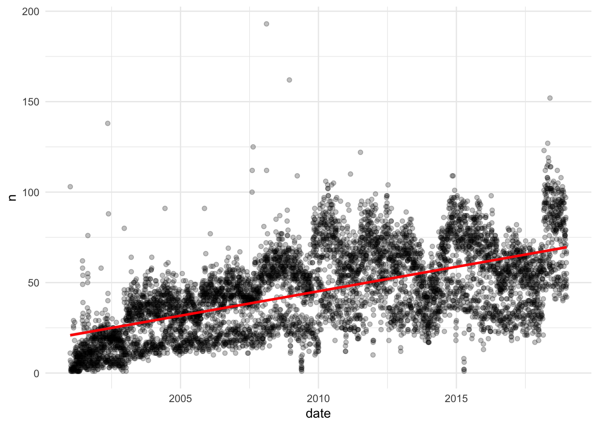

EDA - www.stern.de
================
Gershom Tripp
1 3 2019

This directory contains scripts and data related to archived article content from [www.stern.de](https://www.stern.de/). The dataframes of article content, headlines, authors, etc. can be found in 20 CSVs in `cont_df/`, chunked by year to be github friendly.

The rest of this document consists of some very basic descriptive statistics.

Libraries
---------

``` r
library(tidyverse)
library(lubridate)
library(glue)
theme_set(theme_minimal())
```

Load and describe data
----------------------

As is mentioned above, the data is found in 20 CSVs in the `cont_df/` directory. Every variable is a character string except `timestamp`, which is a date-time, and `categ`, which contains topic categories and is most useful as a factor (categorical variable). It's easiest to just import everything as a string and then modify those two variable in an extra step.

``` r
cont_df <- tibble()

for (f in dir("cont_df/")) {
    cont_df <- bind_rows(cont_df,
                         read_csv2(glue("cont_df/{f}"), col_types = "cccccccccccc")
                         )
}


cont_df <- cont_df %>% 
    mutate(timestamp = as_datetime(timestamp),
           categ = as_factor(categ)
           )
```

There are 304979 observations and 12 variables. A glimpse of the data gives some idea of what each variable looks like.

``` r
cont_df %>% 
    arrange(author, author_guest, press_source) %>% 
    glimpse()
```

    ## Observations: 304,979
    ## Variables: 12
    ## $ categ         <fct> politik, politik, politik, politik, politik, polit…
    ## $ url           <chr> "https://www.stern.de/politik/deutschland/rot-grue…
    ## $ timestamp     <dttm> 2010-07-10 15:23:00, 2010-06-26 16:10:00, 2010-06…
    ## $ catchline     <chr> "Rot-Grün in NRW: Was nicht passt, wird passend ge…
    ## $ uuid          <chr> "1278775380-OTdh4B8eWu2", "1277568600-yLpGQGyOCT8"…
    ## $ headline      <chr> "Was nicht passt, wird passend gemacht", "Bundesne…
    ## $ kicker        <chr> "Rot-Grün in NRW", "Kampf um Schloss Bellevue", "G…
    ## $ press_source  <chr> NA, NA, NA, NA, NA, NA, NA, NA, NA, "Mitarbeit: lk…
    ## $ author        <chr> "Adrian Pickshaus", "Adrian Pickshaus", "Adrian Pi…
    ## $ author_guest  <chr> "Ein Kommentar von Adrian Pickshaus", "Von Adrian …
    ## $ article_intro <chr> "Der Koalitionsvertrag, den SPD und Grüne auf Part…
    ## $ article       <chr> "Der Koalitionsvertrag, den SPD und Grüne auf Part…

An explanation of the variables:

-   `categ` → Category/topic. Retrieved by scraping URLs by topic and date.
-   `url` → Article URL.
-   `timestamp` → Date and time when article was posted +/- a few seconds.
-   `catchline` → Headline + text used in links to article.
-   `uuid` → Unique identifier (datetime + random string) added after scraping.
-   `headline` → Article headline.
-   `kicker` → A bit of text above the headline that gives some context.
-   `press_source` → Sources other than Stern, I think. Found at bottom of article.
-   `author` → Article author.
-   `author_guest` → Seems to be mostly identical to `author`. Both extracted just to be sure
-   `article_intro` → A short paragraph introducing article.
-   `article` → The article text itself. Paragraphs sparated by newline character.

Descriptive statistics
----------------------

The **Politik** category dominates with 68344 articles, followed by **Panorama** (53592), *Kultur* (34460 ), and **Sport** (32547).

``` r
cont_df %>% 
    group_by(categ) %>% 
    count() %>%
    arrange(desc(n)) %>% 
    ungroup(categ) %>% 
    mutate(categ = ordered(categ, levels = categ)) %>% 
    ggplot(aes(x = categ, y = n)) +
    geom_bar(stat = "identity", fill = "#000F71") + 
    coord_flip() + 
    labs(title = "Total articles per category (2000-2019)",
         x = "category",
         y = "count"
         ) +
    theme(panel.grid.minor.y = element_blank(),
          panel.grid.major.y = element_blank()
          )
```



The next plot shows the change in the number of articles published per year, facetted by category. 2019 is excluded as it has barely begun, and the sharp drop off is misleading.

Stern seems to have shifted focus away from some topics and towards others. Brief look at "Panorama" reveals that the category actually contains quite a bit of political content, so it's more likely that they've simply rebranded some content. Still, there is an obvious shift towards more "lifestyle"-centric content.

``` r
cont_df %>% 
    mutate(year = year(timestamp)) %>% 
    filter(year < 2019) %>% 
    group_by(year, categ) %>% 
    count() %>%
    arrange(n) %>% 
    ggplot(aes(x = year, y = n)) +
    geom_line(stat = "identity") + 
    labs(title = "Articles per year (2000-2019),
         by category",
         x = "year",
         y = "count"
         ) + 
    theme(panel.grid.major.x = element_blank(),
          panel.grid.minor.x = element_blank(),
          panel.grid.minor.y = element_blank(),
          axis.text.x = element_text(angle = 45)
          ) + 
    scale_x_continuous(breaks = seq(2001, 2019, 6)) + 
    scale_y_continuous(breaks = seq(0, 7000, 1000)) + 
    facet_wrap(~categ, ncol = 3)
```



The following histogram shows the distribution of characters per article. Most articles have fewer than 12,000 characters. A rug has been added to the plot to hightlight the individual articles, particularly those few articles with more than 50,000 characters.

The longest content appears to be similar to a forum, where a question is asked and various individuals give their opinions. The shortest content seems to be mostly made up of comics, videos, assorted announcements, etc. Some of it should probably be discarded, but some of it might also be worth investigating.

There's a dramatic but barely discernible spike just below the main distribution which likely indicates a particular type of popular content - videos with short, descriptive texts or transcripts, for instance.

``` r
cont_df %>% 
    mutate(chars = nchar(article)) %>% 
    filter(!is.na(chars)) %>% 
    ggplot(aes(x = chars)) + 
    geom_histogram(binwidth = 200) + 
    geom_rug() + 
    scale_x_continuous(breaks = seq(0, 175000, 25000)) + 
    theme(panel.grid.major.x = element_blank(),
          panel.grid.minor.x = element_blank()
          ) +
    labs(title = "Histogram of characters per article",
         x = "number of characters",
         y = "count"
         )
```



Density plots of the characters per articles, broken down by year, are also revealing. Content with more than 10,000 characters has been removed, as have the years 2000 and 2019, which have comparatively few observations.

The main distribution of characters per article seems to have stayed put for the most part, even as total content has grown between 2001 and 2018. The dramatic spike seen in the histogram above first becomes pronounced in 2008. A cursory look at content with 150-250 characters confirms that most of that spike is due to increased video content. (It would have been trivial to check for video content while scraping, but I didn't think of it at the time because it wasn't really part of the plan.)

``` r
cont_df %>% 
    mutate(chars = nchar(article), year = year(timestamp)) %>% 
    filter(year > 2000, year < 2019, !is.na(chars) & chars < 10000) %>% 
    ggplot(aes(x = chars)) + 
    geom_histogram(binwidth = 200) +
    facet_wrap(~year, ncol = 3) +
    scale_y_continuous(breaks = seq(0, 1800, 300)) +
    scale_x_continuous(breaks = seq(0, 10000, 1000)) +
    theme(panel.grid.major.x = element_blank(),
          panel.grid.minor.x = element_blank(),
          panel.grid.minor.y = element_blank()
          ) + 
    labs(title = "Densities of characters per article, facetted by year",
        x = "number of characters", 
        y = "density"
        )
```



A scatter plot confirms the overall content increase that we just saw in the histograms. It also looks like there might be two relatively discrete trends (the horizontal split in the points), perhaps corresponding to two types of content, such as longer articles and videos/clickbait.

``` r
cont_df %>% 
    mutate(date = date(timestamp)) %>% 
    filter(date >= as_date("2001-01-01"), date < as_date("2019-01-01")) %>% 
    group_by(date) %>% 
    count() %>% 
    filter(n < 300) %>% 
    ggplot(aes(x = date, y = n)) + 
    geom_point(alpha = .25) + 
    geom_smooth(method = "lm", color = "red")
```


